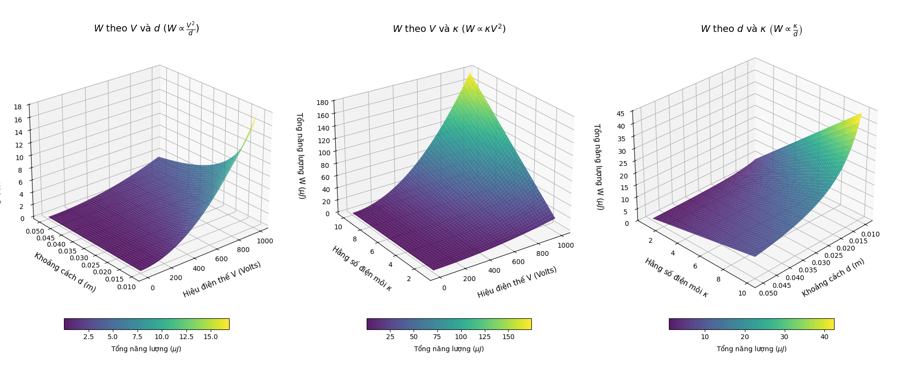
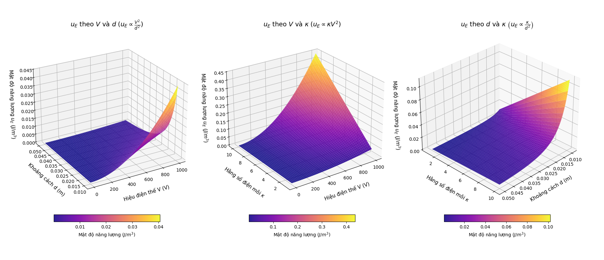
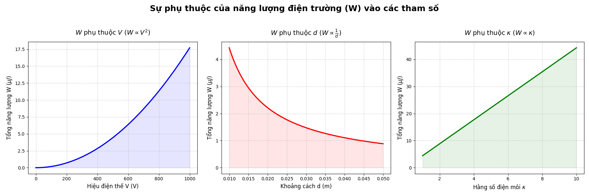
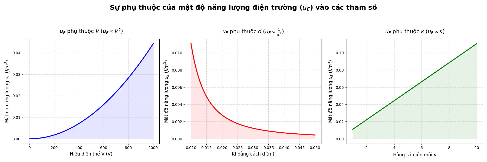
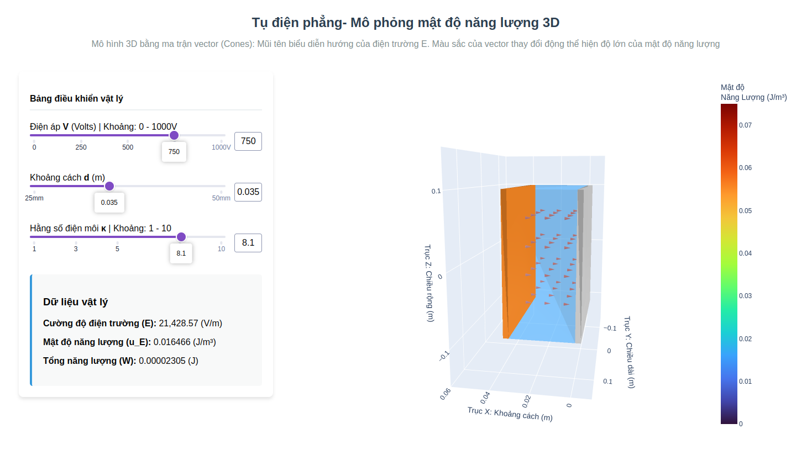
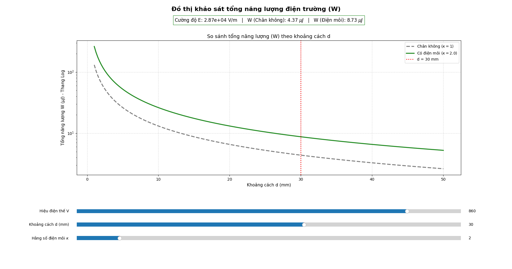
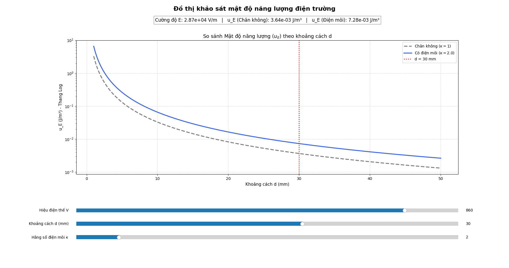

# Đồ Án Mô Phỏng Tụ Điện Phẳng và Năng Lượng Điện Trường

Đây là kho lưu trữ chứa các mã nguồn Python minh họa tính toán và vẽ đồ thị trực quan cho bài toán **Năng lượng của tụ điện phẳng**, bao gồm việc khảo sát **Mật độ năng lượng điện trường ($u_E$)** và **Tổng năng lượng điện trường ($W$)** dựa trên các thông số:
- Hiệu điện thế giữa hai bản tụ ($V$)
- Khoảng cách giữa hai bản tụ ($d$)
- Hằng số điện môi của môi trường ($\kappa$)

---

## 1. Hướng dẫn cài đặt và chạy code

### Môi trường hệ thống
- Yêu cầu cấu hình cài đặt Python 3.7+ trở lên.

### Cài đặt thư viện
Mở command line / terminal tại thư mục chứa mã nguồn (`Assignment`) và chạy lệnh:
```bash
pip install -r requirements.txt
```

### Hướng dẫn sử dụng các file Code

Mã nguồn được chia làm 3 nhóm chính:

**Nhóm 1: Các đồ thị khảo sát tĩnh 2D & 3D (Sử dụng Matplotlib)**
Các file này khi chạy sẽ mở ra một cửa sổ chứa các đồ thị phân tích tính chất vật lý của hai giá trị năng lượng (các file chia làm mặt cắt ngang 2 chiều hoặc mặt biểu đồ cong 3 chiều).
- `python 2D_W.py`: Vẽ đồ thị 2D khảo sát Tổng năng lượng $W$.
- `python 2D_u_E.py`: Vẽ đồ thị 2D khảo sát Mật độ năng lượng $u_E$.
- `python 3D_W.py`: Biểu diễn toán học không gian bề mặt 3D cho Tổng năng lượng $W$.
- `python 3D_u_E.py`: Biểu diễn toán học không gian bề mặt 3D cho Mật độ năng lượng $u_E$.

**Nhóm 2: Khảo sát tương tác trực tiếp bằng Window Slider**
- `python simulation_2D_W.py`
- `python simulation_2D_u_E.py`
*(Khi dùng lệnh khởi chạy file, giao diện giả lập hiện lên và cung cấp cần gạt thanh trượt điều chỉnh $V, d, \kappa$ để người dùng quan sát mức năng lượng tính toán nhảy trực tiếp trên đồ thị hình).*

**Nhóm 3: Ứng dụng Web Dashboard mô phỏng Tụ Phẳng Không Gian Tương Tác**
- `python simulation_3D.py`: Gọi thiết lập máy chủ tạo trang Web App cung cấp khả năng quan sát khối lượng 3 chiều vật lý trực quan nhất.
- Terminal sẽ đưa ra đường link (VD: `http://127.0.0.1:8050`). Bạn cần mở link này bằng một Browser web để tương tác.

---

## 2. Giải thích ý nghĩa hình ảnh minh hoạ kết quả (Mục `export`)

Thư mục `/export/` chứa các bộ ảnh được kết xuất hoặc chụp hình màn hình lại minh chứng cho việc hoạt động chính xác của mã nguồn. Nó giúp đưa ra góc nhìn nhanh và nhận xét vật lý để báo cáo.

### Nhóm Ảnh Đồ thị Tính chất bề mặt 3D

- **`export/3D_W.png`**: Ảnh biểu diễn phân tích xu hướng 3 bề mặt cong 3D phản ánh sự phụ thuộc của dạng sóng phân bố Tổng năng lượng ($W$) vào các tổ hợp cặp tham số. Cung cấp góc nhìn rõ rệt nhất về đỉnh năng lượng tăng khi $V$ tăng hoặc $d$ thu hẹp chiều rộng.


- **`export/3D_uE.png`**: Tính chất tương đồng hình trên nhưng được áp dụng giải cho **Mật độ năng lượng ($u_E$)**. Cấu hình đồ thị này thường có góc dốc và võng gắt hơn cấu hình $W$ do đặc trưng của tỷ lệ.

---

### Nhóm Ảnh Phân tích quy luật Tỷ Lệ mặt phẳng 2D
Làm rõ bản chất phương trình vật lý khi trải nghiệm việc khoá các hằng số không xét, chỉ thả trượt 1 biến đơn lập.

- **`export/2D_W.png`**: Bộ ba đồ thị đặc trưng chứng nhận lý thuyết trong sự phụ thuộc biến sinh của **Tổng năng lượng $W$**: 
  1. $W$ theo $V$ tạo thành đường Parabol lõm dần ($W \propto V^2$). 
  2. $W$ theo $d$ là một đường Hyperbol ($W \propto \frac{1}{d}$). 
  3. $W$ theo $\kappa$ vẽ ra hàm đồ thị tăng trưởng tuyến tính thẳng góc ($W \propto \kappa$).


- **`export/2D_uE.png`**: Khảo sát mặt cắt sự biến đổi đồng dạng cho **Mật độ năng lượng ($u_E$)**: Có nhánh cung đường đồ thị phụ thuộc biến $d$ dốc lõm cong gắt gấp đôi hình đồ thị trước do quy luật chia bậc biểu thức nghịch biến là bình phương ($u_E \propto \frac{1}{d^2}$).

---

### Nhóm Ảnh lưu về Giao diện tương tác UI Mô phỏng
Tài liệu cung cấp cái nhìn về màn hình mà bạn sẽ thấy khi chạy thành công các kịch bản thực tiễn có cung cấp thanh trượt (Slider Interface).


- **`export/simulation_3D.png`**: Giao diện ứng dụng Dash. Có một khối thiết diện tụ không gian 3 chiều có các lưới véctơ tĩnh điện định hướng. Bản vẽ đáp ứng sự tính toán khối tương tác cực kỳ ấn tượng mỗi khi nhích khoảng cách giữa 2 mặt của tụ ở thanh công cụ Dash Toolbar bên trái.


- **`export/simulation_2D_W.png`**: Ảnh chụp Panel màn hình thanh điều khiển kéo thả được code bằng Matplotlib Native để phân phối thông số điện môi mô phỏng sự vọt năng lượng **$W$** so với chất chân không ở điều kiện thật.


- **`export/simulation_2D_uE.png`**: Cấu hình bảng hiển thị tương đồng của file thực thi slider trực tiếp giám sát nhảy biên độ của chỉ số **mật độ năng lượng ($u_E$)**.
